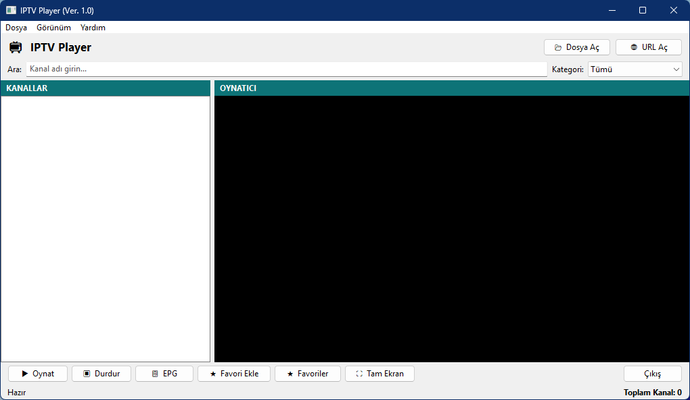
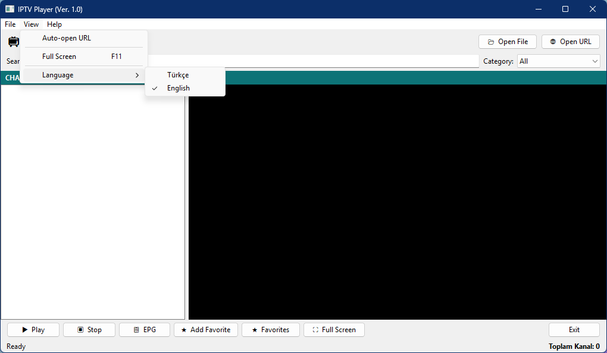
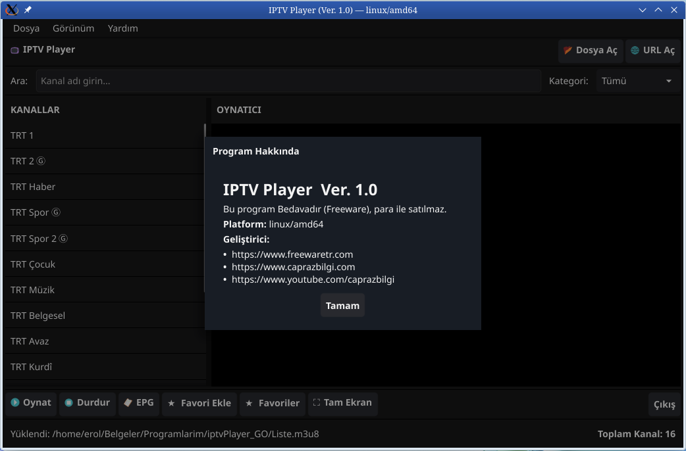

# IPTV Player — Go Edition

A lightweight, cross-platform IPTV player written in Go.  
Plays M3U/M3U8 streams using VLC under the hood, with a clean native UI on every platform.

| Platform | UI Framework | VLC Integration | Video Output |
|---|---|---|---|
| Windows 10/11 | [lxn/walk](https://github.com/lxn/walk) — native Win32 | `libvlc.dll` loaded at runtime | **Inside app window** |
| Linux | [Fyne](https://fyne.io) — OpenGL rendered | `libvlc.so` loaded via [purego](https://github.com/ebitengine/purego) | **Inside app window** |
| macOS | [Fyne](https://fyne.io) — Metal rendered | External VLC process (`exec.Command`) | Separate VLC window |

> **Windows & Linux:** Video renders *inside* the app window — no separate VLC window opens.  
> **macOS:** Video opens in VLC's own window (NSView embedding is a future goal). Channel management, favorites, EPG and settings remain inside the app.

---

## Screenshots





---

## Features

- **M3U / M3U8 playlist support** — load from a local file or any HTTP(S) URL
- **VLC-powered playback** — no CGO required on any platform
- **Embedded video** — video renders directly inside the app window (Windows & Linux)
- **Channel search** — instant filtering by channel name
- **Category filter** — group channels by their M3U `group-title` tag
- **Favorites** — save and manage favorite channels (local SQLite database, persists across restarts)
- **EPG** — view Electronic Program Guide data per channel
- **Fullscreen mode** — dedicated fullscreen window; ESC, F11, or double-click to toggle
- **Preserved window state** — main window position and size are never disturbed by fullscreen
- **Channel logo display** — fetches and caches logos from M3U `tvg-logo` tags
- **Auto-open URL** — configure a playlist URL that loads automatically on startup (✓ checkmark in menu when active)
- **Bilingual UI** — switch between Turkish and English at runtime (✓ checkmark on active language)
- **Menu keyboard shortcuts** — Ctrl+O, Ctrl+U, Ctrl+P, Ctrl+S, Ctrl+E, F11
- **Channel name in title bar** — active channel displayed as `PLAYER (Channel Name)`

---

## Requirements

### Windows

| Requirement | Version | Download |
|---|---|---|
| OS | Windows 10 / 11 (64-bit) | — |
| Go | 1.21 or later | https://go.dev/dl/ |
| VLC Media Player | 3.x or later (64-bit) | https://www.videolan.org/vlc/ |

> No C compiler needed. The entire Windows build is CGO-free.

---

### Linux

| Requirement | Notes |
|---|---|
| OS | Any modern 64-bit distribution (Ubuntu 22.04+, Fedora 38+, etc.) |
| Go | 1.21 or later — only needed if building from source |
| GCC | Required by Fyne (OpenGL renderer) — only needed if building from source |
| OpenGL / Xorg headers | Required by Fyne — only needed if building from source |
| VLC | Provides `libvlc.so.5` — video is embedded inside the app |

#### Option A — Running a Pre-Built Binary

If you downloaded a compiled binary, you only need the runtime libraries (much smaller than build dependencies):

```bash
# 1. Make the binary executable
chmod +x iptvPlayer_go_linux_amd64

# 2. Install runtime libraries
sudo apt install vlc libgl1 libxcursor1 libxrandr2 libxi6 libxinerama1

# 3. Run from a terminal — NOT from the file manager
./iptvPlayer_go_linux_amd64
```

> **XFCE / Thunar users:** Thunar (the XFCE file manager) does not know how to launch
> ELF executables — it shows an **"Open With…" / "Select Application"** dialog instead of
> running the app. Always launch from a terminal.

#### Option B — Building from Source

Install all build **and** runtime dependencies at once:

```bash
# Debian / Ubuntu / Linux Mint
sudo apt install golang gcc libgl1-mesa-dev xorg-dev vlc

# Fedora / RHEL
sudo dnf install golang gcc mesa-libGL-devel libXcursor-devel libXrandr-devel \
     libXinerama-devel libXi-devel vlc

# Arch Linux
sudo pacman -S go gcc mesa libxcursor libxrandr libxinerama libxi vlc
```

#### Desktop Integration (optional — XFCE, GNOME, KDE, etc.)

Create a `.desktop` entry so the app appears in your application menu and can be launched
by double-clicking in the file manager:

```bash
# Adjust the path to match where you placed the binary
BINARY_PATH="$HOME/iptvPlayer_go_linux_amd64"

cat > ~/.local/share/applications/iptv-player.desktop << EOF
[Desktop Entry]
Type=Application
Name=IPTV Player
Comment=M3U/M3U8 IPTV Player powered by VLC
Exec=$BINARY_PATH
Terminal=false
Categories=AudioVideo;Video;Player;
EOF

# Refresh the application database
update-desktop-database ~/.local/share/applications/
```

After this, double-clicking the binary in Thunar will launch the app directly.

---

### macOS

| Requirement | Notes |
|---|---|
| OS | macOS 12 Monterey or later (Intel & Apple Silicon) |
| Go | 1.21 or later |
| Xcode CLI Tools | Required by Fyne (Metal renderer) |
| VLC | Installed via Homebrew or from videolan.org |

```bash
xcode-select --install          # Xcode CLI tools
brew install go                 # Go (or download from go.dev)
brew install --cask vlc         # VLC
```

---

## Getting Started

### Step 1 — Install Go

**Windows:**  
Download the `.msi` installer from https://go.dev/dl/ and run it.

**Linux (recommended):**
```bash
wget https://go.dev/dl/go1.22.4.linux-amd64.tar.gz
sudo rm -rf /usr/local/go
sudo tar -C /usr/local -xzf go1.22.4.linux-amd64.tar.gz
echo 'export PATH=$PATH:/usr/local/go/bin' >> ~/.bashrc
source ~/.bashrc
go version
```

**macOS:**
```bash
brew install go
# or download the .pkg from https://go.dev/dl/
```

---

### Step 2 — Install VLC

| Platform | Command / Link |
|---|---|
| Windows | https://www.videolan.org/vlc/ (64-bit installer) |
| Linux | `sudo apt install vlc` |
| macOS | `brew install --cask vlc` |

---

### Step 3 — Clone the Repository

```bash
git clone https://github.com/erolsavas19/iptvPlayer_GO.git
cd iptvPlayer_GO
```

---

### Step 4 — Download Dependencies

```bash
cd go
go mod download
```

> Requires an internet connection. Allow a couple of minutes on the first run.

---

### Step 5 — Run from Source

**Windows:**
```bat
cd go
go run .
REM  or double-click go\run.bat
```

**Linux / macOS:**
```bash
cd go
./run.sh
# or: go run .
```

---

## Building a Release Executable

### Windows

```bat
cd go
go build -ldflags="-H windowsgui -s -w" -o ../iptvPlayer_go.exe .
```

Or use `go\derle.bat` which handles icon and manifest embedding automatically.

| Flag | Effect |
|---|---|
| `-H windowsgui` | Suppresses the console window |
| `-s -w` | Strips debug symbols, reduces binary size |

---

### Linux

```bash
cd go
chmod +x derle.sh && ./derle.sh
```

Or manually:
```bash
go build -ldflags="-s -w" -o ../iptvPlayer_go_linux_amd64 .
```

---

### macOS

Must be built **natively on a Mac** — Fyne requires CGO + Metal:

```bash
cd go
./derle.sh
```

Or manually:
```bash
# Intel
go build -ldflags="-s -w" -o ../iptvPlayer_go_darwin_amd64 .
# Apple Silicon
GOARCH=arm64 go build -ldflags="-s -w" -o ../iptvPlayer_go_darwin_arm64 .
```

---

### Cross-Compilation

Since the Windows build is entirely CGO-free, you can build the `.exe` from Linux or macOS:

```bash
cd go
GOOS=windows GOARCH=amd64 CGO_ENABLED=0 \
  go build -ldflags="-H windowsgui -s -w" -o ../iptvPlayer_go.exe .
```

> Linux and macOS builds require CGO (Fyne's OpenGL/Metal renderer). Cross-compiling them
> requires a full cross-compiler toolchain — build natively on the target platform instead.

---

## Application Icon

| Platform | Method | Result |
|---|---|---|
| Windows | `rsrc.syso` (COFF resource) linked automatically | Icon embedded in `.exe` |
| Linux | `window.SetIcon()` at runtime — loads `iptvPlayer.ico` | Icon in taskbar / title bar |
| macOS | `window.SetIcon()` at runtime | Icon in Dock / title bar |

The icon file (`go/iptvPlayer.ico`) must be present alongside the binary or in the `go/` subdirectory.

---

## Keyboard Shortcuts

| Shortcut | Action |
|---|---|
| `Ctrl+O` | Open M3U file |
| `Ctrl+U` | Open URL |
| `Ctrl+P` | Play |
| `Ctrl+S` | Stop |
| `Ctrl+E` | Show EPG |
| `F11` | Toggle fullscreen |
| `ESC` | Exit fullscreen |
| Double-click video | Toggle fullscreen |

---

## Project Structure

```
iptvPlayer_GO/
├── README.md
├── LICENSE
├── .gitignore
├── iptvPlayer_go.exe            ← compiled Windows executable
├── iptvPlayer_go_linux_amd64   ← compiled Linux executable
└── go/                          ← all source files
    │
    ├── ── Shared (all platforms) ──────────────────────────────────
    ├── main.go              ← entry point; logging, panic recovery, chdir
    ├── config.go            ← shared constants (window size, etc.)
    ├── db.go                ← SQLite: favourites and app settings
    ├── m3u.go               ← M3U/M3U8 parser
    ├── lang.go              ← TR/EN string tables
    │
    ├── ── Windows-only (//go:build windows) ───────────────────────
    ├── fatal_windows.go     ← runApp() + showFatalError()
    ├── app.go               ← core struct; M3U loading, playback, favourites
    ├── mainwindow.go        ← main window layout (lxn/walk)
    ├── video_win.go         ← VLC video render area (HWND subclassing)
    ├── fullscreen_win.go    ← fullscreen toggle (Win32 API)
    ├── vlc.go               ← VLC libvlc.dll integration (no CGO)
    ├── dialogs.go           ← favourites, EPG, URL input windows (walk)
    ├── manifest_win.go      ← Windows DPI-aware manifest + Common Controls v6
    ├── rsrc.syso            ← pre-compiled COFF resources (icon + manifest)
    ├── iptvPlayer.ico       ← application icon
    ├── run.bat              ← run-from-source helper
    ├── derle.bat            ← release build script
    │
    ├── ── Linux-only (//go:build linux) ───────────────────────────
    ├── vlc_linux.go         ← libvlc.so loaded via purego (no CGO);
    │                           frame callbacks render video inside Fyne canvas
    │
    ├── ── macOS-only (//go:build darwin) ──────────────────────────
    ├── vlc_darwin.go        ← VLC launched via exec.Command (external window)
    │
    └── ── Linux / macOS (//go:build linux || darwin) ──────────────
        ├── fatal_unix.go    ← runApp() + showFatalError()
        ├── app_unix.go      ← core struct + full Fyne UI
        ├── dialogs_unix.go  ← favourites, EPG, URL input dialogs (Fyne)
        ├── run.sh           ← run-from-source helper
        └── derle.sh         ← release build script
```

---

## Dependencies

| Package | Purpose | Platforms |
|---|---|---|
| `github.com/lxn/walk` | Native Windows GUI framework | Windows only |
| `github.com/lxn/win` | Low-level Windows API bindings | Windows only |
| `golang.org/x/sys` | DLL loading, Windows system calls | Windows only |
| `fyne.io/fyne/v2` | Cross-platform GUI (OpenGL/Metal) | Linux, macOS |
| `github.com/ebitengine/purego` | CGO-free shared library loading (`libvlc.so`) | Linux |
| `modernc.org/sqlite` | Pure-Go SQLite driver (no CGO) | All platforms |

---

## How VLC Is Integrated

### Windows — Embedded (`libvlc.dll`)
`libvlc.dll` is loaded at runtime via `LoadLibrary` — no CGO, no C compiler.  
Video is rendered directly into a Win32 child window (`HWND`) inside the app via `libvlc_media_player_set_hwnd`.

### Linux — Embedded (`libvlc.so`)
`libvlc.so.5` is loaded at runtime via [purego](https://github.com/ebitengine/purego) — no CGO, no headers.  
VLC writes each video frame into a Go byte buffer using `libvlc_video_set_callbacks` (RGBA, 1280×720).  
A goroutine copies the buffer into a Fyne `canvas.Image` and calls `Refresh()` — video appears seamlessly inside the app window.

### macOS — External Process
The `vlc` binary is launched via `os/exec` for each playback session.  
Video appears in VLC's own window while all channel management, search, favorites and EPG remain in the app.  
_(NSView embedding is planned for a future release.)_

---

## Troubleshooting

### Linux (XFCE / Thunar): "Open With" or "Select Application" dialog appears

Thunar (XFCE file manager) does not execute ELF binaries directly — it opens an
"Open With" dialog instead of running the app.

**Solution: always launch from a terminal.**
```bash
chmod +x iptvPlayer_go_linux_amd64
./iptvPlayer_go_linux_amd64
```

For a permanent fix, create a `.desktop` entry (see [Desktop Integration](#desktop-integration-optional--xfce-gnome-kde-etc) above).

---

### Linux: OpenGL or display errors at runtime

On minimal desktop environments (XFCE, LXDE, etc.) the OpenGL runtime may not be
installed even when build dependencies are present:

```bash
sudo apt install libgl1 libxcursor1 libxrandr2 libxi6 libxinerama1
```

---

### Linux: Fyne build errors

```bash
sudo apt install gcc libgl1-mesa-dev xorg-dev
```

---

### Linux: `libvlc.so.5` not found at runtime

```bash
sudo apt install vlc libvlc5
ldconfig -p | grep libvlc     # verify the library is found
```

---

### macOS: Gatekeeper blocks the binary

```bash
xattr -cr ./iptvPlayer_go_darwin_amd64
```

---

### Windows: VLC not found at startup

Ensure 64-bit VLC is installed. The app searches the Windows registry and
`C:\Program Files\VideoLAN\VLC\` automatically.

---

### All platforms: favorites or settings lost after restart

When running via `go run`, the working directory is `go/` and `favorites.db` is created there.  
A compiled binary uses its own directory. Both are intentional and separate.

---

## License

MIT License — see [LICENSE](LICENSE) for details.

---
---

# IPTV Player — Go Sürümü

Go ile yazılmış, çok platformlu hafif bir IPTV oynatıcısı.  
M3U/M3U8 akışlarını VLC altyapısıyla oynatır; kullanıcı arayüzü platforma göre farklı framework'lerle oluşturulur.

| Platform | Arayüz | VLC Entegrasyonu | Video Çıktısı |
|---|---|---|---|
| Windows 10/11 | [lxn/walk](https://github.com/lxn/walk) — Yerel Win32 | `libvlc.dll` çalışma zamanında yüklenir | **Uygulama penceresi içinde** |
| Linux | [Fyne](https://fyne.io) — OpenGL tabanlı | `libvlc.so` [purego](https://github.com/ebitengine/purego) ile yüklenir | **Uygulama penceresi içinde** |
| macOS | [Fyne](https://fyne.io) — Metal tabanlı | Harici VLC process (`exec.Command`) | Ayrı VLC penceresi |

> **Windows ve Linux:** Video doğrudan uygulama penceresine gömülür — ayrı bir VLC penceresi açılmaz.  
> **macOS:** Video VLC'nin kendi penceresinde açılır (NSView gömme gelecekte planlanmaktadır). Kanal yönetimi, favoriler, EPG ve ayarlar uygulama penceresinde kalır.

---

## Ekran Görüntüleri


---

## Özellikler

- **M3U / M3U8 playlist desteği** — yerel dosya veya HTTP(S) URL'den yükleme
- **VLC tabanlı oynatma** — hiçbir platformda CGO gerekmez
- **Gömülü video** — video doğrudan uygulama penceresi içinde oynar (Windows ve Linux)
- **Kanal arama** — kanal adına göre anlık filtreleme
- **Kategori filtresi** — M3U `group-title` etiketine göre gruplama
- **Favoriler** — favori kanalları kaydetme ve yönetme (SQLite, yeniden başlatmalarda korunur)
- **EPG** — Elektronik Program Rehberi verilerini kanal bazında görüntüleme
- **Tam ekran modu** — ayrı pencere yaklaşımı; ESC, F11 veya çift tıklama ile geçiş
- **Pencere konumu korunur** — tam ekrana giriş/çıkış ana pencerenin konumunu veya boyutunu bozmaz
- **Kanal logosu görüntüleme** — M3U `tvg-logo` etiketlerindeki logolar indirilir ve önbelleğe alınır
- **Otomatik URL açma** — başlangıçta otomatik yüklenecek playlist URL'si ayarı (aktifken menüde ✓ işareti)
- **İki dilli arayüz** — çalışma sırasında Türkçe/İngilizce geçişi (aktif dil menüde ✓ ile işaretlenir)
- **Menü klavye kısayolları** — Ctrl+O, Ctrl+U, Ctrl+P, Ctrl+S, Ctrl+E, F11
- **Başlık çubuğunda kanal adı** — aktif kanal `OYNATICI (Kanal Adı)` biçiminde gösterilir

---

## Sistem Gereksinimleri

### Windows

| Gereksinim | Sürüm | İndirme |
|---|---|---|
| İşletim Sistemi | Windows 10 / 11 (64-bit) | — |
| Go | 1.21 veya üzeri | https://go.dev/dl/ |
| VLC Media Player | 3.x veya üzeri (64-bit) | https://www.videolan.org/vlc/ |

> C derleyicisi gerekmez. Windows derlemesi tamamen CGO-free'dir.

---

### Linux

| Gereksinim | Notlar |
|---|---|
| İşletim Sistemi | Modern 64-bit dağıtım (Ubuntu 22.04+, Fedora 38+ vb.) |
| Go | 1.21 veya üzeri — yalnızca kaynak koddan derleyecekseniz gerekli |
| GCC | Fyne'ın OpenGL renderer'ı için — yalnızca kaynak koddan derleyecekseniz gerekli |
| OpenGL / Xorg başlıkları | Fyne için — yalnızca kaynak koddan derleyecekseniz gerekli |
| VLC | `libvlc.so.5` sağlar — video uygulama içinde oynar |

#### Seçenek A — Hazır Binary ile Çalıştırma

Derlenmiş binary indirdiyseniz yalnızca çalışma zamanı kütüphaneleri yeterlidir (derleme bağımlılıklarından çok daha az):

```bash
# 1. Binary'ye çalıştırma izni verin
chmod +x iptvPlayer_go_linux_amd64

# 2. Çalışma zamanı kütüphanelerini kurun
sudo apt install vlc libgl1 libxcursor1 libxrandr2 libxi6 libxinerama1

# 3. Terminalde çalıştırın — dosya yöneticisinden DEĞİL
./iptvPlayer_go_linux_amd64
```

> **XFCE / Thunar kullanıcıları:** Thunar (XFCE dosya yöneticisi) ELF binary dosyalarını
> doğrudan çalıştırmayı bilmez — uygulamayı başlatmak yerine **"Uygulamayla Aç" / "Listeden
> bir uygulama seç"** dialog'u gösterir. Uygulamayı her zaman bir **terminal** üzerinden başlatın.

#### Seçenek B — Kaynak Koddan Derleme

Derleme **ve** çalışma zamanı bağımlılıklarını tek komutla kurun:

```bash
# Debian / Ubuntu / Linux Mint
sudo apt install golang gcc libgl1-mesa-dev xorg-dev vlc

# Fedora / RHEL
sudo dnf install golang gcc mesa-libGL-devel libXcursor-devel libXrandr-devel \
     libXinerama-devel libXi-devel vlc

# Arch Linux
sudo pacman -S go gcc mesa libxcursor libxrandr libxinerama libxi vlc
```

#### Masaüstü Entegrasyonu (isteğe bağlı — XFCE, GNOME, KDE vb.)

Uygulamanın uygulama menüsünde görünmesi ve dosya yöneticisinden çift tıklamayla
başlatılabilmesi için `.desktop` girdisi oluşturun:

```bash
# Binary'nin bulunduğu tam yolu girin
BINARY_PATH="$HOME/iptvPlayer_go_linux_amd64"

cat > ~/.local/share/applications/iptv-player.desktop << EOF
[Desktop Entry]
Type=Application
Name=IPTV Player
Comment=VLC destekli M3U/M3U8 IPTV oynatıcısı
Exec=$BINARY_PATH
Terminal=false
Categories=AudioVideo;Video;Player;
EOF

# Uygulama veritabanını yenileyin
update-desktop-database ~/.local/share/applications/
```

Bu işlemden sonra Thunar'da binary'ye çift tıklamak doğrudan uygulamayı başlatır.

---

### macOS

| Gereksinim | Notlar |
|---|---|
| İşletim Sistemi | macOS 12 Monterey veya üzeri (Intel ve Apple Silicon) |
| Go | 1.21 veya üzeri |
| Xcode CLI Araçları | Fyne'ın Metal renderer'ı için gereklidir |
| VLC | Homebrew ile veya videolan.org'dan kurulur |

```bash
xcode-select --install          # Xcode CLI araçları
brew install go                 # Go (veya go.dev'den indir)
brew install --cask vlc         # VLC
```

---

## Kurulum ve Çalıştırma

### Adım 1 — Go Kurulumu

**Windows:**  
https://go.dev/dl/ adresinden `.msi` dosyasını indirin ve kurun.

**Linux (önerilen yöntem):**
```bash
wget https://go.dev/dl/go1.22.4.linux-amd64.tar.gz
sudo rm -rf /usr/local/go
sudo tar -C /usr/local -xzf go1.22.4.linux-amd64.tar.gz
echo 'export PATH=$PATH:/usr/local/go/bin' >> ~/.bashrc
source ~/.bashrc
go version
```

**macOS:**
```bash
brew install go
# veya https://go.dev/dl/ adresinden .pkg indirin
```

---

### Adım 2 — VLC Kurulumu

| Platform | Komut / Bağlantı |
|---|---|
| Windows | https://www.videolan.org/vlc/ (64-bit yükleyici) |
| Linux | `sudo apt install vlc` |
| macOS | `brew install --cask vlc` |

---

### Adım 3 — Depoyu İndirin

```bash
git clone https://github.com/erolsavas19/iptvPlayer_GO.git
cd iptvPlayer_GO
```

---

### Adım 4 — Bağımlılıkları İndirin

```bash
cd go
go mod download
```

> İnternet bağlantısı gerektirir. İlk çalıştırmada 1-2 dakika sürebilir.

---

### Adım 5 — Çalıştırın

**Windows:**
```bat
cd go
go run .
REM  veya go\run.bat dosyasına çift tıklayın
```

**Linux / macOS:**
```bash
cd go
./run.sh
# veya: go run .
```

---

## Derleme (Release Build)

### Windows

```bat
cd go
go build -ldflags="-H windowsgui -s -w" -o ../iptvPlayer_go.exe .
```

| Bayrak | Efekt |
|---|---|
| `-H windowsgui` | Konsol penceresi açılmaz |
| `-s -w` | Debug sembolleri çıkarılır, dosya küçülür |

Alternatif olarak `go\derle.bat` kullanılabilir.

---

### Linux

```bash
cd go
chmod +x derle.sh && ./derle.sh
```

Veya elle:
```bash
go build -ldflags="-s -w" -o ../iptvPlayer_go_linux_amd64 .
```

---

### macOS

Mac'te yerel olarak derlenmelidir (Fyne, CGO + Metal gerektirir):

```bash
cd go
./derle.sh
```

Veya elle:
```bash
# Intel
go build -ldflags="-s -w" -o ../iptvPlayer_go_darwin_amd64 .
# Apple Silicon
GOARCH=arm64 go build -ldflags="-s -w" -o ../iptvPlayer_go_darwin_arm64 .
```

---

### Çapraz Derleme

Windows derlemesi CGO içermediğinden Linux veya macOS'tan `.exe` üretilebilir:

```bash
cd go
GOOS=windows GOARCH=amd64 CGO_ENABLED=0 \
  go build -ldflags="-H windowsgui -s -w" -o ../iptvPlayer_go.exe .
```

> Linux ve macOS derlemeleri CGO (Fyne) gerektirdiğinden çapraz derleme için ek araç
> zinciri gerekir; hedef platformda yerel olarak derlemek önerilir.

---

## Uygulama İkonu

| Platform | Yöntem | Sonuç |
|---|---|---|
| Windows | `rsrc.syso` (COFF kaynağı) linker tarafından otomatik gömülür | İkon `.exe` içinde |
| Linux | `window.SetIcon()` — çalışma zamanında `iptvPlayer.ico` yüklenir | Görev çubuğu / başlık çubuğu ikonu |
| macOS | `window.SetIcon()` — çalışma zamanında yüklenir | Dock / başlık çubuğu ikonu |

---

## Klavye Kısayolları

| Kısayol | İşlem |
|---|---|
| `Ctrl+O` | M3U dosyası aç |
| `Ctrl+U` | URL aç |
| `Ctrl+P` | Oynat |
| `Ctrl+S` | Durdur |
| `Ctrl+E` | EPG göster |
| `F11` | Tam ekran geçiş |
| `ESC` | Tam ekrandan çık |
| Video üzerine çift tıklama | Tam ekran geçiş |

---

## Proje Yapısı

```
iptvPlayer_GO/
├── README.md
├── LICENSE
├── .gitignore
├── iptvPlayer_go.exe            ← Derlenmiş Windows uygulaması
├── iptvPlayer_go_linux_amd64   ← Derlenmiş Linux uygulaması
└── go/                          ← Tüm kaynak kodlar
    │
    ├── ── Ortak (tüm platformlar) ─────────────────────────────────
    ├── main.go              ← Giriş noktası; log, panic kurtarma, chdir
    ├── config.go            ← Ortak sabitler (pencere boyutu vb.)
    ├── db.go                ← SQLite: favoriler ve uygulama ayarları
    ├── m3u.go               ← M3U/M3U8 ayrıştırıcı
    ├── lang.go              ← TR/EN dil dizileri
    │
    ├── ── Yalnızca Windows (//go:build windows) ───────────────────
    ├── fatal_windows.go     ← runApp() + showFatalError()
    ├── app.go               ← Temel yapı; M3U yükleme, oynatma, favoriler
    ├── mainwindow.go        ← Ana pencere düzeni (lxn/walk)
    ├── video_win.go         ← VLC video render alanı (HWND subclassing)
    ├── fullscreen_win.go    ← Tam ekran geçiş mantığı (Win32 API)
    ├── vlc.go               ← VLC libvlc.dll entegrasyonu (CGO yok)
    ├── dialogs.go           ← Favoriler, EPG, URL giriş pencereleri (walk)
    ├── manifest_win.go      ← Windows DPI farkındalığı + Common Controls v6
    ├── rsrc.syso            ← Önceden derlenmiş COFF kaynakları (ikon + manifest)
    ├── iptvPlayer.ico       ← Uygulama ikonu
    ├── run.bat              ← Kaynak koddan çalıştırma (Windows)
    ├── derle.bat            ← Release derleme scripti (Windows)
    │
    ├── ── Yalnızca Linux (//go:build linux) ───────────────────────
    ├── vlc_linux.go         ← libvlc.so purego ile yüklenir (CGO yok);
    │                           frame callback'leri video'yu Fyne canvas'a render eder
    │
    ├── ── Yalnızca macOS (//go:build darwin) ──────────────────────
    ├── vlc_darwin.go        ← VLC exec.Command ile başlatılır (harici pencere)
    │
    └── ── Linux / macOS (//go:build linux || darwin) ──────────────
        ├── fatal_unix.go    ← runApp() + showFatalError()
        ├── app_unix.go      ← Temel yapı + tam Fyne UI
        ├── dialogs_unix.go  ← Favoriler, EPG, URL giriş diyalogları (Fyne)
        ├── run.sh           ← Kaynak koddan çalıştırma (Linux/macOS)
        └── derle.sh         ← Release derleme scripti (Linux/macOS)
```

---

## Bağımlılıklar

| Paket | Amaç | Platform |
|---|---|---|
| `github.com/lxn/walk` | Yerel Windows GUI framework'ü | Yalnızca Windows |
| `github.com/lxn/win` | Düşük seviye Windows API bağlamaları | Yalnızca Windows |
| `golang.org/x/sys` | DLL yükleme, Windows sistem çağrıları | Yalnızca Windows |
| `fyne.io/fyne/v2` | Çok platformlu GUI (OpenGL/Metal) | Linux, macOS |
| `github.com/ebitengine/purego` | CGO-free paylaşılan kütüphane yükleme (`libvlc.so`) | Linux |
| `modernc.org/sqlite` | Saf Go SQLite sürücüsü (CGO gerektirmez) | Tüm platformlar |

---

## VLC Entegrasyon Detayları

### Windows — Gömülü (`libvlc.dll`)
`libvlc.dll`, `LoadLibrary` ile çalışma zamanında yüklenir — CGO veya C derleyicisi gerekmez.  
Video, `libvlc_media_player_set_hwnd` ile doğrudan Win32 alt penceresine render edilir.

### Linux — Gömülü (`libvlc.so`)
`libvlc.so.5`, [purego](https://github.com/ebitengine/purego) ile çalışma zamanında yüklenir — CGO veya başlık dosyası gerekmez.  
VLC, her video karesini `libvlc_video_set_callbacks` (RGBA, 1280×720) aracılığıyla Go byte buffer'ına yazar.  
Bir goroutine buffer'ı Fyne `canvas.Image`'a kopyalar ve `Refresh()` çağırır — video uygulama penceresi içinde sorunsuz oynar.

### macOS — Harici Process
Her oynatma oturumunda `os/exec` ile `vlc` komutu başlatılır. Video VLC'nin kendi penceresinde açılırken kanal listesi, arama, favoriler ve EPG uygulama penceresinde kalır.  
_(NSView gömme gelecek sürümlerde planlanmaktadır.)_

---

## Sorun Giderme

### Linux (XFCE / Thunar): "Uygulamayla Aç" veya "Listeden bir uygulama seç" dialog'u çıkıyor

Thunar (XFCE dosya yöneticisi) ELF binary dosyalarını doğrudan çalıştırmaz — uygulamayı
başlatmak yerine "Uygulamayla Aç" dialog'u gösterir.

**Çözüm: her zaman terminalden çalıştırın.**
```bash
chmod +x iptvPlayer_go_linux_amd64
./iptvPlayer_go_linux_amd64
```

Kalıcı çözüm için yukarıdaki [Masaüstü Entegrasyonu](#masaüstü-entegrasyonu-isteğe-bağlı--xfce-gnome-kde-vb) bölümüne bakın.

---

### Linux: Çalışma zamanında OpenGL veya ekran hatası

Minimal masaüstü ortamlarında (XFCE, LXDE vb.) derleme bağımlılıkları kurulu olsa bile
OpenGL çalışma zamanı kütüphaneleri eksik olabilir:

```bash
sudo apt install libgl1 libxcursor1 libxrandr2 libxi6 libxinerama1
```

---

### Linux: Fyne derleme hataları

```bash
sudo apt install gcc libgl1-mesa-dev xorg-dev
```

---

### Linux: `libvlc.so.5` çalışma zamanında bulunamadı

```bash
sudo apt install vlc libvlc5
ldconfig -p | grep libvlc     # kütüphanenin bulunduğunu doğrulayın
```

---

### macOS: Gatekeeper binary'yi engelledi

```bash
xattr -cr ./iptvPlayer_go_darwin_amd64
```

---

### Windows: Başlangıçta VLC bulunamadı

64-bit VLC'nin kurulu olduğundan emin olun. Uygulama Windows kayıt defterini ve
`C:\Program Files\VideoLAN\VLC\` yolunu otomatik arar.

---

### Tüm platformlar: Favoriler veya ayarlar yeniden başlatmada sıfırlanıyor

`go run` ile çalıştırıldığında `favorites.db` dosyası `go/` klasöründe oluşturulur.  
Derlenmiş binary kendi bulunduğu klasörü kullanır. Her iki durum kasıtlı ve birbirinden bağımsızdır.

---

## Lisans

MIT Lisansı — detaylar için [LICENSE](LICENSE) dosyasına bakın.
